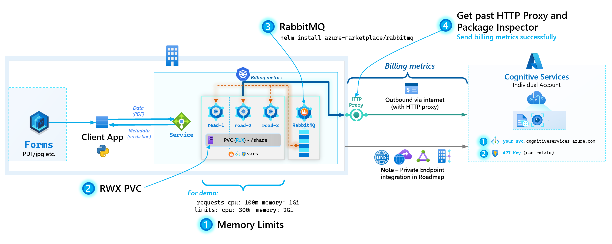
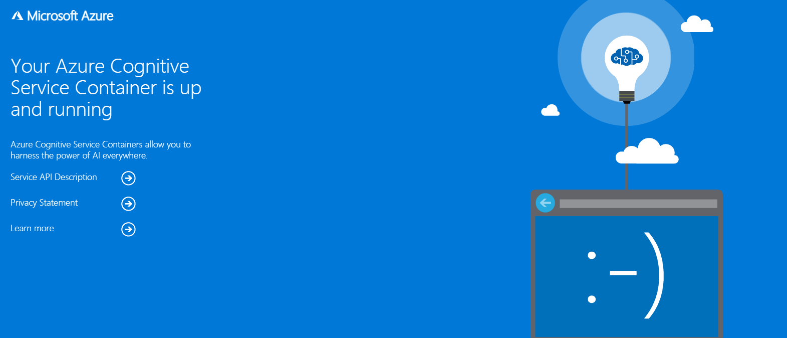
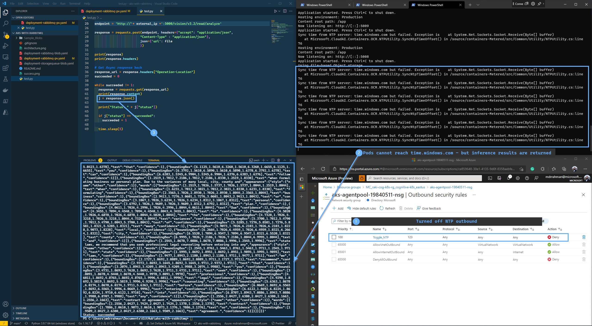

# aks-with-rabbitmq

We showcase the following entities in this repo:


## Demo environment setup

We follow [this](https://docs.microsoft.com/en-us/azure/cognitive-services/computer-vision/deploy-computer-vision-on-premises#deploy-multiple-v3-containers-on-the-kubernetes-cluster) tutorial's sections of:

- Prerequisites
- Gathering required parameters

## Powershell script

The following Powershell script can be used to setup the end-to-end demo environment in one pass:

```PowerShell
az account set --subscription "<your-subscription-name>"
$rg = "your-rg"
az group create --name $rg --location EastUS

$cognitive_name = "your-unique-cognitive-svc-name"

# Create Cognitive Services Resource
az cognitiveservices account create `
    --name $cognitive_name `
    --resource-group $rg `
    --kind CognitiveServices `
    --sku S0 `
    --location canadacentral `
    --yes

az cognitiveservices account keys list `
    --name $cognitive_name `
    --resource-group $rg

# {
#  "key1": "413ad0ac8df743258e...",
#  "key2": "582395cad305440387..."
# }

# Create AKS cluster
$k8s = "your-aks-cluster"
az aks create -g $rg `
							--name $k8s `
							--ssh-key-value 'ssh-rsa AAAAB3N...LBISw==' `
							--node-count 3 `
							--node-vm-size Standard_D4s_v3 # 4 vCPU, 16 GB RAM

# Grab kubeconfig from AKS
az aks get-credentials -g $rg --name $k8s
kubectl get nodes

# Create RabbitMQ
helm repo add azure-marketplace https://marketplace.azurecr.io/helm/v1/repo
helm install azure-marketplace/rabbitmq --generate-name

# Get secret name
kubectl get secret --all-namespaces | grep rabbitmq
# rabbitmq-1631876849

$base64_secret = kubectl get secret --namespace default rabbitmq-1631876849 -o jsonpath="{.data.rabbitmq-password}"
[System.Text.Encoding]::UTF8.GetString([System.Convert]::FromBase64String($base64_secret))
# OT9W0C3V75

# Access RabbitMQ UI
kubectl get svc -n default | grep rabbitmq
# rabbitmq-1631876849

kubectl port-forward --namespace default svc/rabbitmq-1631876849 15672:15672
# http://127.0.0.1:15672/

# Localize dpeloyment yaml ...\aks-with-rabbitmq\deployment-rabbitmq-pv.yaml - see instructions below before running kubectl apply -f ..

# Create pods
kubectl apply -f ...\aks-with-rabbitmq\deployment-rabbitmq-pv.yaml

# Pods get deployed
# kubectl get pods
# NAME                    READY   STATUS    RESTARTS   AGE
# rabbitmq-1631801457-0   1/1     Running   0          39m
# read-958db58bc-975js    1/1     Running   0          56s
# read-958db58bc-hl8x6    1/1     Running   0          56s
# read-958db58bc-hnqxw    1/1     Running   0          56

# Tail logs
kubectl logs read-958db58bc-dszm4 --follow
kubectl logs read-958db58bc-ksw5h --follow
kubectl logs read-958db58bc-nsm9j --follow

# Localize test.py with the external LB
kubectl get svc -n default | grep azure-cognitive-service-read
# 52.188.143.206
```

### Prepare deployment.yaml

In `deployment.yaml`:

1. Fill in the endpoint and api key under `billing` and `apikey`
2. Fill `Queue__RabbitMQ__HostName` with `NAME.default.svc` from the RabbitMQ pod generation output
3. Fill `Queue__RabbitMQ__VirtualHost` with the deafult `/`
4. Fill `Queue__RabbitMQ__Username` and `Queue__RabbitMQ__Password` with the commands from the RabbitMQ pod generation output

Username is `user` and password is a random 10 character string.

5. Fill `Queue__RabbitMQ__Port` with the default `5672`
6. Set `replicas` to `3` or other depending on K8s capacity.

## Test UI

To test it worked, in your browser run `EXTERNAL-IP:5000` - e.g. `52.188.143.206:5000`.

You should get the following output:



You can also browse to the swagger UI via `http://52.188.143.206:5000/swagger`.

## Test with Python

In `test.py`, update the `external_ip` variable with your `EXTERNAL-IP`

Run `python test.py`.

The output should be an array of the following object:

```
{
    "boundingBox": [
        2.3211,
        8.9176,
        2.458,
        8.9176,
        2.458,
        8.9944,
        2.3211,
        8.9944
    ],
    "confidence": 1,
    "text": "as"
}
```

---

# Notes

### 1. NTP outbound

At this time, note that the Containers reach out to `time.windows.com` for syncing system time. If NTP outbound (`UDP 123`) is blocked on the Pod - the following logs show up:

```text
Sync time from NTP server: time.windows.com but failed. Exception is    at System.Net.Sockets.Socket.Receive(Byte[] buffer)
   at Microsoft.CloudAI.Containers.OCR.NTPUtility.SyncNtpTimeOffset() in /source/containers-Metered/src/Common/Utility/NTPUtility.cs:line 76
:line 76
```

Preliminary tests show that these should be non-blocking from performing Inference calls:

