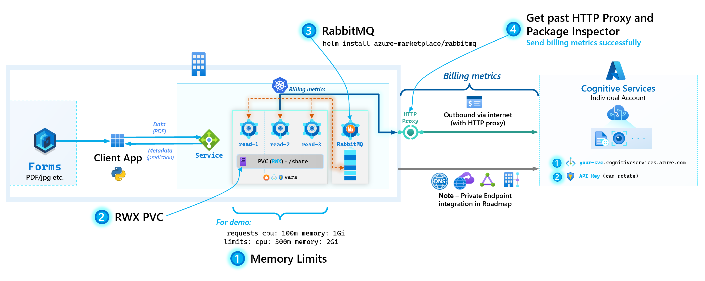
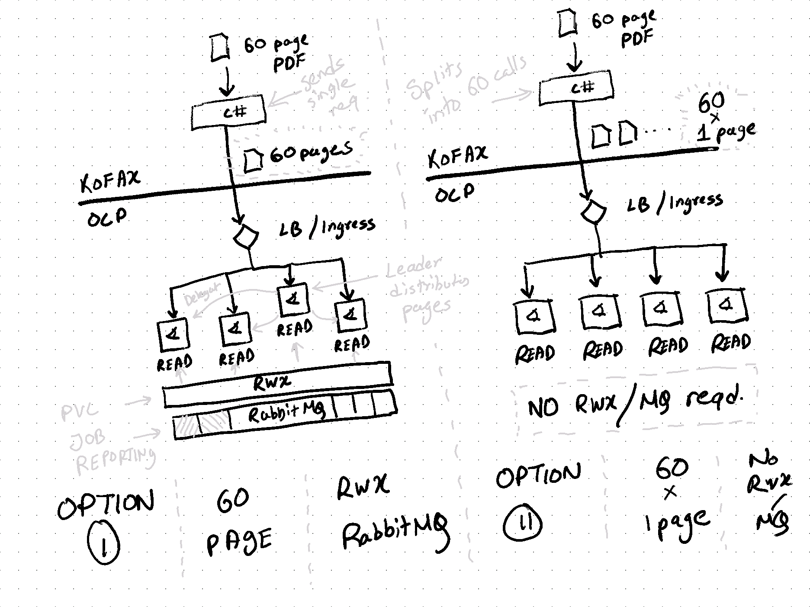
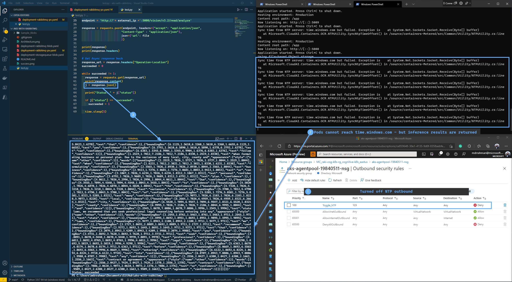

# Cognitive Services on Kubernetes

## Table of Contents <!-- omit in toc -->
- [Cognitive Services on Kubernetes](#cognitive-services-on-kubernetes)
- [Architecture Diagrams](#architecture-diagrams)
- [Python Image Refresher](#python-image-refresher)
- [Demo environment setup](#demo-environment-setup)
  - [Dev Container](#dev-container)
  - [Bash script](#bash-script)
    - [Prepare deployment.yaml](#prepare-deploymentyaml)
  - [Test UI](#test-ui)
  - [Test with Python](#test-with-python)
- [Lessons learned](#lessons-learned)
    - [1. NTP outbound](#1-ntp-outbound)


# Architecture Diagrams

We showcase the following entities in this repo:


**Alternative**: In case RabbitMQ and `RWX` PVC's are not available, splitting of the document can be done in the client side:



# Python Image Refresher
The official docs below:
* https://docs.microsoft.com/en-us/azure/cognitive-services/cognitive-services-container-support
* https://docs.microsoft.com/en-us/azure/cognitive-services/containers/container-image-tags?tabs=previous

...do not synchronously get updated with the latest container images/tags. So I created a Python script to scrape Microsoft Container Registry to generate the latest builds. This way, if a new container is released, this script will pick it up.

```Python
# create venv
cd image-refresher
python3 -m venv env
source env/bin/activate
python3 -m pip install -r requirements.txt
ipython kernel install --user --name=env # Install new kernel for Jupyter

# Run image-refresher.ipynb - which will spit out a markdown file containing all images
```

# Demo environment setup

We follow [this](https://docs.microsoft.com/en-us/azure/cognitive-services/computer-vision/deploy-computer-vision-on-premises#deploy-multiple-v3-containers-on-the-kubernetes-cluster) tutorial's sections of:

- Prerequisites
- Gathering required parameters

## Dev Container
The folder `.devcontainer` has necessary tools to get started on this demo with [Remote Containers](https://code.visualstudio.com/docs/remote/containers).

## Bash script

The following script deploys an AKS - 3 Read pods + RabbitMQ.

<details>
<summary>Detailed steps</summary>

The following Powershell script can be used to setup the end-to-end demo environment in one pass:

```bash
# Variables
spnClientId="..."
spnClientSecret="..."
spnTenantId="..."
subscriptionId="..."
rg="raki-cogs-1"
k8s="aks-cni"
cognitive_name="raki-cogs-multi-1"

# Login to Azure
az login --service-principal --username $spnClientId --password $spnClientSecret --tenant $spnTenantId
az account set --subscription $subscriptionId

# Create RG
az group create --name $rg --location EastUS

# Create Cognitive Services Resource
az cognitiveservices account create \
    --name $cognitive_name \
    --resource-group $rg \
    --kind CognitiveServices \
    --sku S0 \
    --location EastUS \
    --yes

az cognitiveservices account keys list \
    --name $cognitive_name \
    --resource-group $rg

# {
#   "key1": "130b03c5d84048f296571525141a3d33",
#   "key2": "fc5a6fed573640c9816a099db8e9f527"
# }

# Create AKS cluster
# 8 vCPU, 32 GB RAM
az aks create -g $rg --name $k8s \
                     --node-count 3 \
                     --enable-cluster-autoscaler \
                     --min-count 1 \
                     --max-count 5 \
                     --generate-ssh-keys \
                     --node-vm-size Standard_D8s_v3

# Grab kubeconfig from AKS
az aks get-credentials -g $rg --name $k8s
kubectl get nodes

# Create RabbitMQ
helm repo add azure-marketplace https://marketplace.azurecr.io/helm/v1/repo
helm repo update
helm install azure-marketplace/rabbitmq --generate-name

# Get secret name
kubectl get secret --all-namespaces | grep rabbitmq
# rabbitmq-1643850952
base64_secret=$(kubectl get secret --namespace default rabbitmq-1643850952 -o jsonpath="{.data.rabbitmq-password}")
# Decode
echo $base64_secret | base64 --decode
# SvWBo1uNKv

# Access RabbitMQ UI
kubectl get svc -n default | grep rabbitmq
# rabbitmq-1643850952
kubectl port-forward --namespace default svc/rabbitmq-1643850952 15672:15672
# http://127.0.0.1:15672/

# Localize deployment yaml ...\multi-pod\read-rabbitmq-pv.yaml.yaml - see instructions below before running kubectl apply -f ..
kubectl apply -f multi-pod/read-rabbitmq-pv.yaml

# Pods get deployed
# kubectl get pods
# NAME                    READY   STATUS    RESTARTS   AGE
# rabbitmq-1643850952-0   1/1     Running   0          28m
# read-6fdddf88cd-5lzhv   1/1     Running   0          17m
# read-6fdddf88cd-bxrnq   1/1     Running   0          17m
# read-6fdddf88cd-d7bl7   1/1     Running   0          17m
# read-6fdddf88cd-rll99   1/1     Running   0          17m
# read-6fdddf88cd-zc7qk   1/1     Running   0          17m

# Tail logs
kubectl logs read-958db58bc-dszm4 --follow
kubectl logs read-958db58bc-ksw5h --follow
# ...

# Localize test.py with the external LB
kubectl get svc -n default | grep azure-cognitive-service-read
# 20.121.145.67
```

</details>

### Prepare deployment.yaml

In `deployment.yaml`:

1. Fill in the endpoint and api key under `billing` and `apikey`
2. Fill `Queue__RabbitMQ__HostName` with `NAME.default.svc` from the RabbitMQ pod generation output
3. Fill `Queue__RabbitMQ__VirtualHost` with the deafult `/`
4. Fill `Queue__RabbitMQ__Username` and `Queue__RabbitMQ__Password` with the commands from the RabbitMQ pod generation output

Username is `user` and password is a random 10 character string.

5. Fill `Queue__RabbitMQ__Port` with the default `5672`
6. Set `replicas` to `3` or other depending on K8s capacity.

## Test UI

To test it worked, in your browser run `EXTERNAL-IP:5000` - e.g. `52.188.143.206:5000`.

You should get the following output:


You can also browse to the swagger UI via `http://52.188.143.206:5000/swagger`.

## Test with Python

```bash
# create venv
cd test-scripts
python3 -m venv env
source env/bin/activate
python3 -m pip install -r requirements.txt
python3 read-test-benchmark-bigfile.py
```

In `test-scripts/read-test.py`, update the `external_ip` variable with your `EXTERNAL-IP`

Run `python3 read-test.py`.

The output should be an array of the following object:

```
{
    "boundingBox": [
        2.3211,
        8.9176,
        2.458,
        8.9176,
        2.458,
        8.9944,
        2.3211,
        8.9944
    ],
    "confidence": 1,
    "text": "as"
}
```

With `read-test-benchmark-bigfile.py` - we scan 2 PDFs and capture the timestamp - we see the following results showcasing that more pods helps reduce the time significatly via horizontal scaling:
| PDF Pages | Pods | Time taken (s) |
| --- | --- | --- |
| 2 | 5 | 3.02 |
| 20 | 5 | 🟢 19.18 |
| 2 | 1 | 3.33 |
| 20 | 1 | 🔴 45.8 |

---

# Lessons learned

### 1. NTP outbound

At this time, note that the Containers reach out to `time.windows.com` for syncing system time. If NTP outbound (`UDP 123`) is blocked on the Pod - the following logs show up:

```text
Sync time from NTP server: time.windows.com but failed. Exception is    at System.Net.Sockets.Socket.Receive(Byte[] buffer)
   at Microsoft.CloudAI.Containers.OCR.NTPUtility.SyncNtpTimeOffset() in /source/containers-Metered/src/Common/Utility/NTPUtility.cs:line 76
:line 76
```

Preliminary tests show that these should be non-blocking from performing Inference calls:


NTP Sync can also be disabled via setting the Container environment variable:

```yaml
- name: EnableSyncNTPServer
  value: "false"
```
